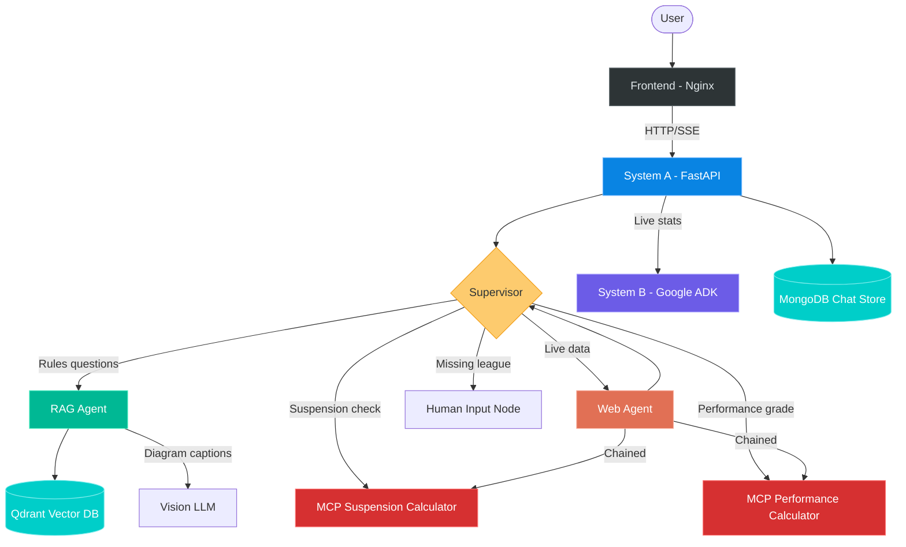

# Basketball Multi-Agent Assistant

A multi-agent RAG system that answers basketball rules questions across **NBA**, **FIBA**, **FIBA 3x3**, and **NCAA** rulebooks. The system combines document retrieval, web search, and tool-based computation through an intelligent routing supervisor.

**Who it's for:** Basketball coaches, referees, analysts, students, and fans who need quick, accurate answers about basketball rules without reading through thousands of pages of official documentation.

---

## Architecture



### Services (7 containers)

| Service | Role | Port |
|---------|------|------|
| **Frontend** | Nginx serving the chat UI | 3000 |
| **System A** | Main orchestrator (FastAPI + LangGraph) | 8000 |
| **System B** | Live Web stats via Google ADK | 8001 |
| **Qdrant** | Vector database for document embeddings | 6333 |
| **MongoDB** | Chat history persistence | 27017 |
| **MCP Suspension** | Technical foul suspension risk calculator | 5002 |
| **MCP Performance** | Player performance grading tool | 5003 |


## Setup Instructions

### Prerequisites
- Docker and Docker Compose
- An OpenRouter API key (https://openrouter.ai)
- A Google API key (https://aistudio.google.com)

- The four PDF rulebooks (NBA, FIBA, FIBA 3x3, NCAA) placed in the project root

### 1. Clone and Configure

```bash
git clone https://github.com/YOUR_USERNAME/basketball-multiagent-assistant.git
cd basketball-multiagent-assistant
cp .env.example .env
```

Edit `.env` and add your API keys:
```
OPENROUTER_API_KEY=sk-or-v1-your-key-here
GOOGLE_API_KEY=your-google-key-here
```

### 2. Start All Services

```bash
docker compose up -d --build
```

This starts all 7 containers. System A will take about 60 seconds to become healthy (loading embedding models).

### 3. Ingest Documents

On first run, you need to parse and embed the rulebook PDFs:

```bash
# Parse PDFs into structured chunks
python scripts/run_ingestion.py

# This creates vector collections in Qdrant
```

Make sure the PDF files are in the project root:
- `Official-2025-26-NBA-Playing-Rules.pdf`
- `documents-corporate-fiba-official-rules-2026-v1-1.pdf`
- `fiba-3x3-basketball-rules-full-version.pdf`
- `2025-26 Men's Basketball Rules Book-BR26.pdf`

### 4. Access the Application

Open http://localhost:3000 in your browser.

### Configuration Options

All configurable via `.env`:

| Variable | Options | Default |
|----------|---------|---------|
| `ROUTE_MODE` | `rag_only`, `full` | `full` |
| `RETRIEVAL_PIPELINE` | `dense`, `hybrid`, `rerank`, `hybrid_rerank` | `hybrid_rerank` |
| `RETRIEVAL_COLLECTION` | `markdown_mpnet`, `markdown_bge_m3`, etc. | `markdown_mpnet` |
| `EMBEDDING_DEVICE` | `cuda`, `cpu` | `cuda` |

---

## Technical Decisions

### Why Multi-Agent over Monolithic RAG

A single RAG pipeline cannot handle the diversity of basketball queries. Rules questions need document retrieval; live stats need web search; suspension risk and performance score needs computation. The supervisor decides the routing plan and each agent formats and returns its own answer directly to the user. The supervisor also supports chained execution (e.g., web search for stats, then feed into the performance calculator).

### Why Hybrid Rerank Retrieval

We benchmarked 16 configurations (4 embedding collections x 4 retrieval pipelines) across 3 test datasets. Hybrid search (dense + sparse) with cross-encoder reranking consistently outperformed all other configurations, with `markdown_mpnet x hybrid_rerank` achieving the best results. See `EVALUATION.md` for the full comparison.

### Why a separate Google ADK system B

System B uses Google ADK for real-time WEB data. Isolating it as a separate service keeps the main agent framework (LangGraph) clean as well as Google ADK being a great choice for a web search agent since it handles it natively with Google search and only needs a google api key as a setup. It also demonstrates a genuine multi-system microservice architecture.

### Why we chose these MCP Tools

A very big point of struggle of LLMs is math calculations therefore we implemented 2 separate Fast API MCP tools to handle the calculations of player suspension risk and performance grading.

---

## Known Limitations

- **LLM rate limits**: OpenRouter cheap tier rate limits can cause retry errors during high-throughput evaluation runs. Production deployment would need a dedicated API key with higher limits.
- **Off-season MCP data**: The suspension calculator returns zeroes during the NBA off-season rather than indicating that data is unavailable, which can produce misleading results.
- **Answer correctness scores**: RAGAS correctness metrics are penalized when the LLM generates verbose, well-cited answers compared to brief ground truth strings. The actual answer quality is higher than the scores suggest.
- **Conversation context**: Follow-up queries lose context quickly in some scenarios and hallucinate answers the user never asked for, doesnt happen all the time as the demo will show but longer conversations will lose context.
- **Highly complex queries**: as shown in the evaluations, the retrieval results degraded by 15-20% on the highly complex test set 3 showing the model can struggle with complex logic and being able to find all the edge cases in complex rules.(also shown in the failure cases)
- **Terminal MCP nodes**: The MCP tools (suspension/performance calculators) are terminal nodes in the graph, after they run, the result goes directly to the user without passing back through the supervisor. This means the supervisor cannot do post-processing or combine MCP results with other agent outputs in the same query.

---

## Project Structure

```
basketball-multiagent-assistant/
|-- api/                    # FastAPI application (System A entry point)
|   |-- main.py             # Routes, SSE streaming, guardrails
|-- src/
|   |-- agents/             # LangGraph agents
|   |   |-- graph.py        # Workflow assembly
|   |   |-- supervisor.py   # Query routing and language detection
|   |   |-- rag_agent.py    # Document retrieval and generation
|   |   |-- web_agent.py    # Web search 
|   |   |-- mcp_agent.py    # MCP tool integration
|   |   |-- human_input.py  # League disambiguation
|   |   |-- guardrails.py   # Input validation and topic filtering
|   |   |-- state.py        # Shared agent state schema
|   |-- ingestion/          # PDF parsing and chunking
|   |-- embedding/          # Embedding model loading
|   |-- retrieval/          # Dense, hybrid, rerank pipelines
|   |-- vectorstore/        # Qdrant client wrapper
|   |-- evaluation/         # RAGAS and retrieval metrics
|   |-- config.py           # Central configuration
|-- system_b/               # System B (Google ADK agent)
|-- mcp_servers/
|   |-- suspension_calculator/
|   |-- performance_calculator/
|-- frontend/               # Nginx + static HTML/CSS/JS
|-- scripts/                # Evaluation and ingestion scripts
|-- data/                   # Test datasets and parsed documents
|-- docker-compose.yml
|-- Dockerfile              # System A container
|-- .env.example
|-- EVALUATION.md
|-- CHANGELOG.md
```

---

## Evaluation

See [EVALUATION.md](EVALUATION.md) for the complete evaluation report including:
- Retrieval metrics across 16 configurations
- RAGAS generation scores (Faithfulness, Relevancy, Correctness)
- Agent routing accuracy (100%)
- Three failure cases with analysis
